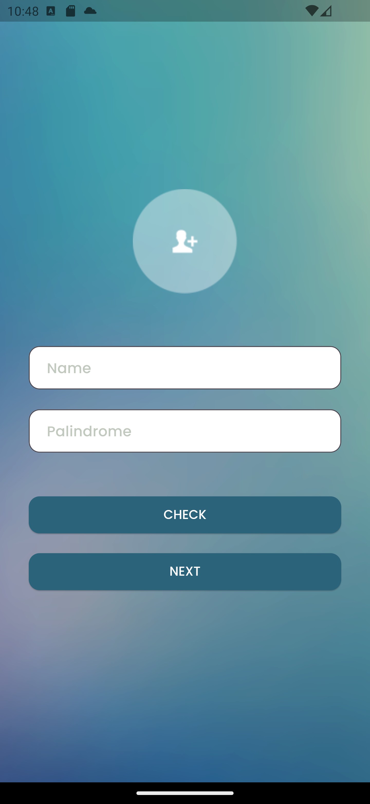
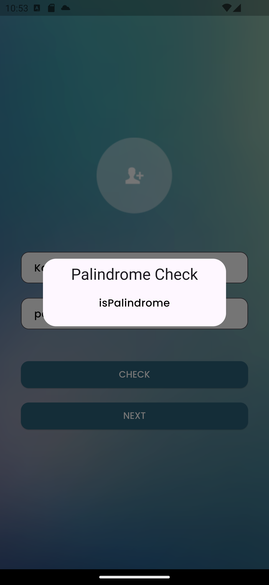
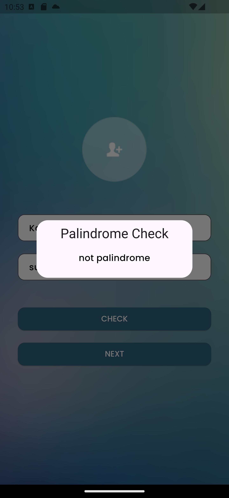
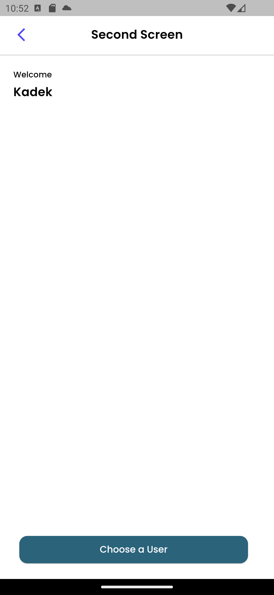
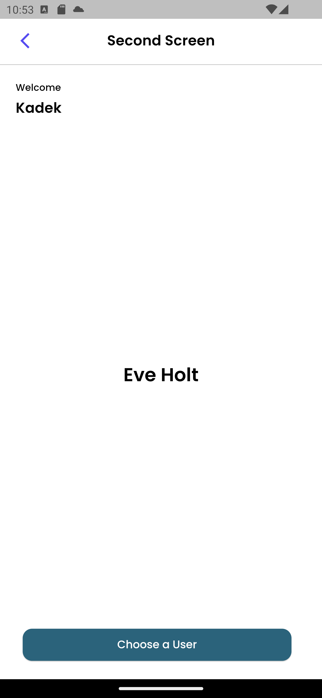
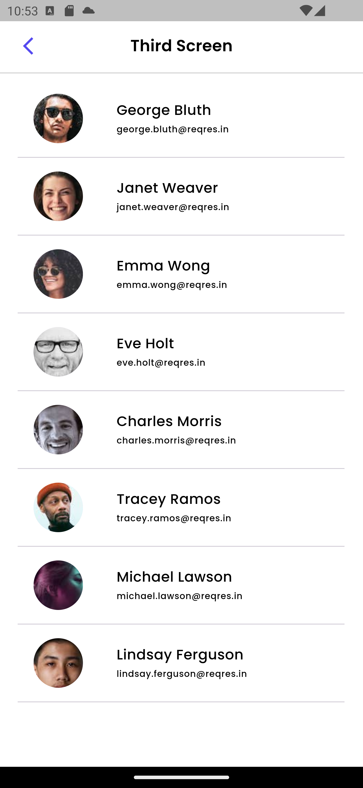
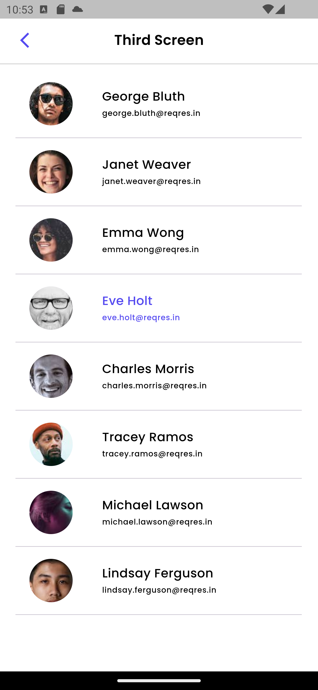

# Suitmedia Test

Project ini dibuat sebagai hasil pelaksanaan test suitmedia untuk posisi sebagai Mobile Developer Intern 

## Demo Aplikasi

berikut merupakan link video demonstrasi dari penggunaan aplikasi
https://youtu.be/hIU-AsZaID0

## Screenshot
### Screen 1 (Home Page)
berikut merupakan halaman home page pada screen 1 

### Screen 1 (Is Palindrom)
berikut merupakan hasil output berupa dialog ketika is palindrom 

### Screen 1 (not Palindrom)
berikut merupakan hasil output berupa dialog ketika not palindrom 

### Screen 2 (Welcome Page)
berikut merupakan halaman welcome page pada screen 2 

### Screen 2 (Welcome Page with Selected User)
berikut merupakan halaman welcome page pada screen 2 dengan menampilkan selected user 

### Screen 3 (User Page)
berikut merupakan halaman user page pada screen 3 

### Screen 3 (User Page with Selected User)
berikut merupakan halaman home page pada screen 3 dengan selected user yang dipilih saat ini 
